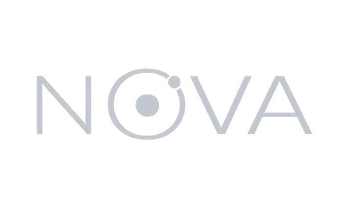

<p align="center">
  
</p>

<p align="center">
  
  
  
  
</p>

# Nova (Alpha / WIP)

**Nova** is a deterministic tensor runtime and automatic differentiation engine, currently CPU-first, designed for **machine learning and scientific computing**, with a particular focus on **physics-informed and HPC-oriented workflows**.

Nova is written from first principles in modern C++ with a Python 3 frontend.  
It emphasises **explicit execution**, **transparent memory management**, and **clear architectural boundaries**, rather than maximising convenience or surface-level feature breadth.

Nova is intended for researchers and engineers who want to understand — and control — how their numerical workloads execute.

---

## What is Nova?

Nova is **not** a drop-in replacement for existing deep learning frameworks.

Instead, it is a research-oriented runtime that explores a different set of design trade-offs:

- Deterministic execution over implicit asynchrony
- Explicit memory ownership over opaque allocation
- Inspectable computation graphs over hidden mutation
- First-class support for scientific and physics-driven workloads

The long-term goal of Nova is to support **differentiable physics and machine learning within a single, coherent execution engine**, 
suitable for traditional CPU- and MPI-based HPC environments as well as modern ML workflows.

---

## Design Goals

Nova is built around the following principles:

- **Explicitness**  
  Execution order, memory ownership, and differentiation are never implicit.

- **Determinism**  
  Given the same inputs and configuration, Nova aims to produce the same results.

- **Separation of concerns**  
  Tensor semantics, kernels, autodiff, and higher-level APIs are deliberately decoupled.

- **Extensibility**  
  The system is designed to support user-defined operations, including physics solvers, without requiring a DSL or compiler pipeline.

- **Transparency over abstraction**  
  Complexity is not hidden — it is structured and made inspectable.

---

## Current Capabilities (v0.1 focus)

### Tensor Core
- Dense tensor storage with explicit layout
- NumPy-style broadcasting and reduction semantics
- Zero-copy tensor views
- SIMD-accelerated elementwise operations
- BLAS-backed linear algebra

### Memory Management
- Pluggable allocator interfaces
- Pool-based allocation for reuse and alignment
- Deterministic ownership via RAII
- Architecture designed to support arena and slab allocators

### Automatic Differentiation
- Reverse-mode autodiff with explicit SSA-style graphs
- Deterministic forward and backward execution
- Explicit forward and adjoint definitions per operation
- Topological sorting with cycle detection
- Thread-local autodiff contexts
- No implicit graph mutation during backpropagation

### Python Interface
- Python frontend with thin bindings over the C++ core (via pybind11)
- High-level abstractions for:
  - Tensors
  - Layers
  - Models
  - Optimisers
  - Loss functions
- NumPy interoperability

--- 

## Execution Backends and SIMD Support

Nova is currently targeting a **CPU-first execution model**, with explicit control over threading, memory, and vectorisation.
GPU support is planned for the future.

| Component                | Status          | Notes                                                           |
|--------------------------|-----------------|-----------------------------------------------------------------|
| CPU (x86_64)             | ✅ Supported     |                                                                 |
| CPU (ARM64)              | ✅ Supported     |                                                                 |
| SIMD (ARM NEON)          | ✅ Supported     | Explicit NEON vector kernels                                    |
| SIMD (x86 AVX/SSE)       | ⚠️ In Progress  | SIMD kernels for selected operations; scalar fallback elsewhere |
| Scalar fallback          | ✅ Supported     | Guaranteed portable execution                                   |
| BLAS (OpenBLAS)          | ✅ Supported     | Default on Linux                                                |
| BLAS (Accelerate)        | ✅ Supported     | Default on macOS                                                |
| BLAS (Intel MKL)         | ⚠️ In Progress  | Support for windows/linux pending                               |
| Multithreaded CPU        | ⚠️ In Progress     | Deterministic thread pool                                       |
| Single-process runtime   | ✅ Supported     | No implicit asynchronous execution                              |
| Windows                  | ❌ Not supported | Blocked by MKL / BLAS integration                               |
| GPU (any vendor)         | ❌ Not supported | GPU support planned for future release                          |
| Distributed execution    | ❌ Not supported | MPI planned for future releases                                 |

---

## Physics-Oriented Direction

A core motivation behind Nova is the observation that, in many scientific ML workflows, **the physics simulation — not the model — is the dominant computational and conceptual bottleneck**.

Nova is being designed so that:

- Physics solvers can be represented as **first-class graph nodes**
- Forward simulation and adjoint computation are explicit
- Long-running, CPU-bound, and MPI-oriented workloads are natural fits
- ML models act as consumers or parameterisations of physics, rather than the other way around

Early versions focus on correctness and extensibility rather than breadth or peak performance.

---

## Example

A simple multi-layer perceptron:

```python
from nova.src.blocks.core import InputBlock, Linear
from nova.src.blocks.activations import ReLU
from nova.src.blocks.regularisation import Dropout
from nova.src.models import Model

inp = InputBlock((None, 10))
x = Linear(100, "random_normal")(inp)
x = ReLU()(x)
x = Dropout(0.5)(x)
x = Linear(10, "random_normal")(x)
out = ReLU()(x)

model = Model(inputs=[inp], outputs=[out])
```

### Training with an explicit autodiff context:

```python
from nova.src.backend.core import Grad
from nova.src.optim.sgd import SGD
from nova.src.losses import MeanSquaredError

optimizer = SGD(model.parameters(), lr=1e-3)
loss_fn = MeanSquaredError()

with Grad():
    y_pred = model(x)
    loss = loss_fn(y_pred, y)
    loss.backward()

optimizer.step()
```


## Installation

Nova is currently built from source and targets development and research use.

Requirements
- C++20-compatible compiler
- CMake ≥ 3.21
- Python ≥ 3.11 (Python 3.12 currently used in development - but we wi)
- pybind11
- BLAS (system or vendor-provided)

## Building Nova (CPU backend)

Nova provides a `Makefile` that wraps CMake presets and common development configurations. All of the below
build will automatically place the .so executable in the `Nova/nova/src/backend/core/clib` dir, which is the C++ module 
that powers the frontend python API.

### Development build
```bash
make dev
```
Build output:
```
Nova/build/dev
```
A `compile_commands.json` symlink is created in the project root when available.

### Release build

Optimised release build with inter-procedural optimisation:
```bash
make release
```
Output:
```bash
Nova/build/release
```

### CPU profiling build
```bash
make cpu-profile
```
### AddressSanitiser build
```bash
make asan
```
### Incremental rebuild
```bash
make rebuild
```

The Python extension module is built as part of the CMake process and can be imported directly from the project root.
Packaging, wheels, and stable installation paths are under active development.

### Python tests
```bash
pytest -v 
```

## Documentation
- Architecture overview: `ARCH.md`
- Development roadmap: `ROADMAP.md`
- API and module documentation: `docs/`

Documentation will expand as the public API stabilises.

## Project Status
- Active development
- CPU backend is the current primary focus
- APIs may change
- Performance tuning and numerical validation are ongoing
- Despite this, Nova is already usable for real numerical workloads and model training, and serves as a foundation for further research and experimentation.

## Contributing

Contributions are welcome, particularly from those interested in:
- Systems programming
- Numerical computing
- Automatic differentiation
- Memory allocation strategies
- Performance engineering
- Physics-informed and scientific machine learning

Contribution guidelines will be added in CONTRIBUTING.md.